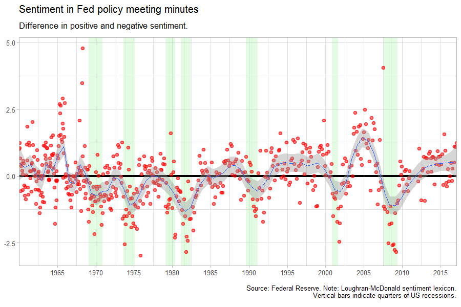
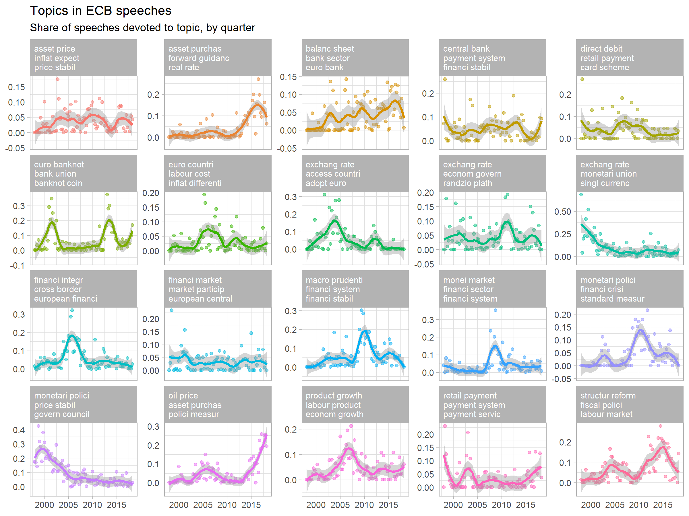
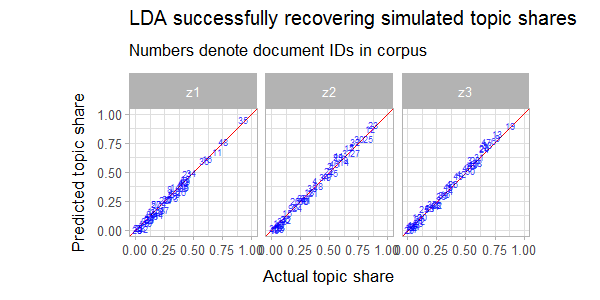

<!-- README.md is generated from README.Rmd. Please edit that file -->

```{r setup, include = FALSE}
knitr::opts_chunk$set(
  collapse = TRUE,
  comment = "#>"
)
```

# Text mining workshop

Teaching materials for text mining workshop.              

Note that most examples require the `cbcoms` package, which is only available
on request.

## Course outline

1. Counting words
    * Example: Federal Reserve speeches
1. Example 2: Sentiment analysis
    * Example: Federal Reserve minutes
1. Topic modelling
    * Example: ECB speeches
1. Regular expressions
    * Example: `babynames` package
1. Data-generating process for LDA
    * Example: Simulated ECB speeches

## Sample of generated output







