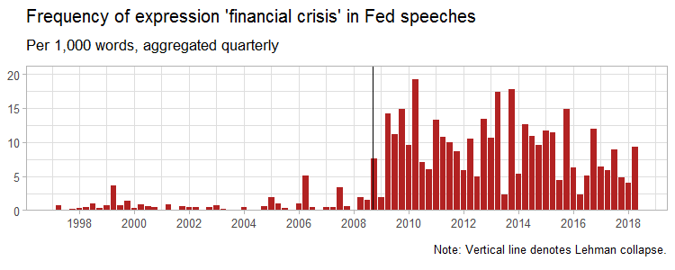
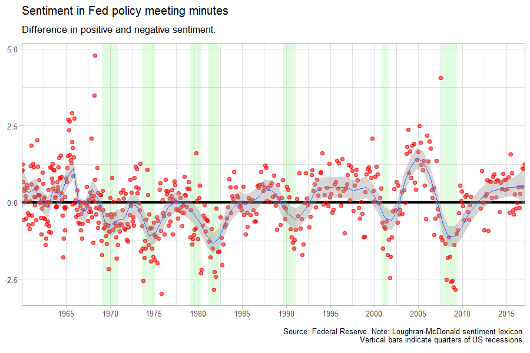
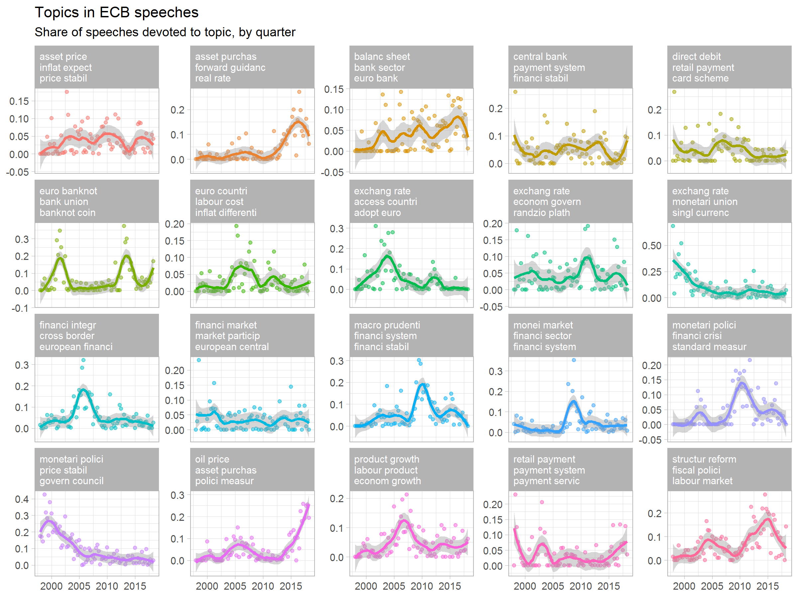
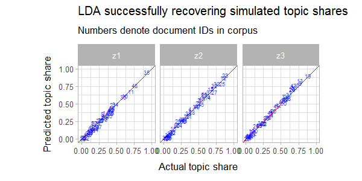

<!-- README.md is generated from README.Rmd. Please edit that file -->

# Text mining workshop

Teaching materials for text mining workshop.

## Course outline

1.  Counting words
      - Example: Federal Reserve speeches
2.  Example 2: Sentiment analysis
      - Example: Federal Reserve minutes
3.  Topic modelling
      - Example: ECB speeches
4.  Regular expressions
      - Example: `babynames` package
5.  Data-generating process for LDA
      - Example: Simulated ECB speeches

## Sample of generated output

